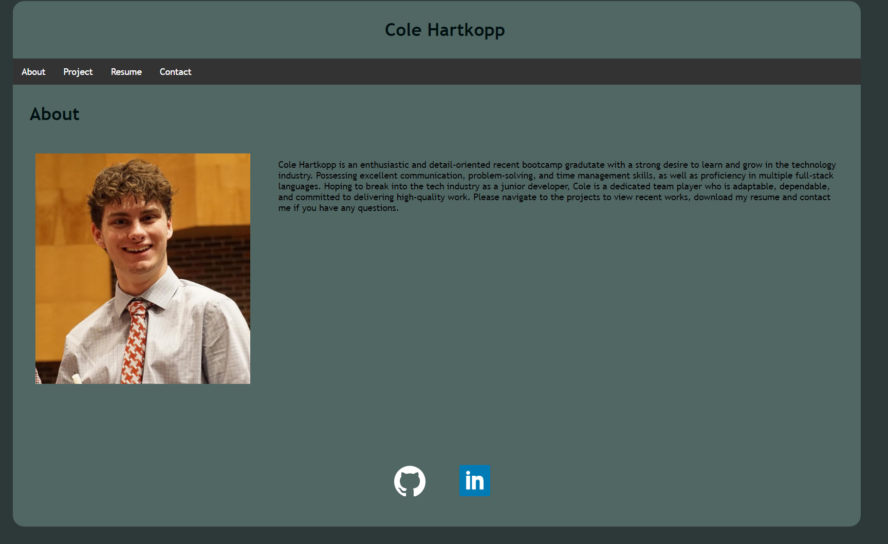

# React Portfolio

## Table of Contents
* [Description](#description)
* [Portfolio](#portfolio)
* [Usage](#usage)
* [Contributing](#contributing)
* [Questions](#questions)

## Description
This project is a portfolio of work samples to show my potential as a future employee. It includes sections about me, some of my recent projects, a downloadable resume, and a contact form that goes straight to my email.

## Portfolio

## Usage
My portfolio can be used by future employers to access my skills and previous work to evaluate myself for employed positions. Click here to visit my portfolio, [Cole Hartkopp Portfolio](https://zencoh.github.io/reactPortfolio/).

## Contributing
I am currently not taking contributions for the code of this project but if you are trying to reach out to me please visit the contact page on my portfolio.

## Questions
For any questions, please feel free to reach out to me on GitHub at [zencoh](https://github.com/zencoh). You can also reach me at chsoccer4@outlook.com.
